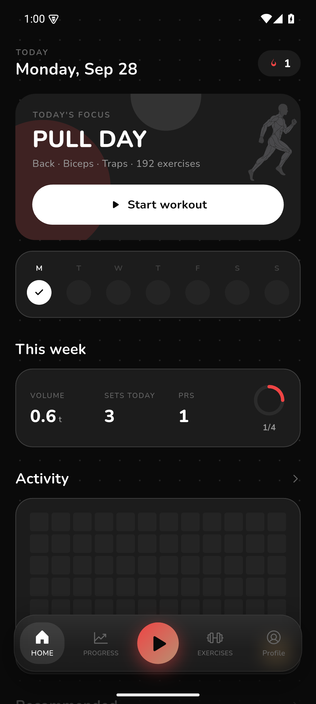
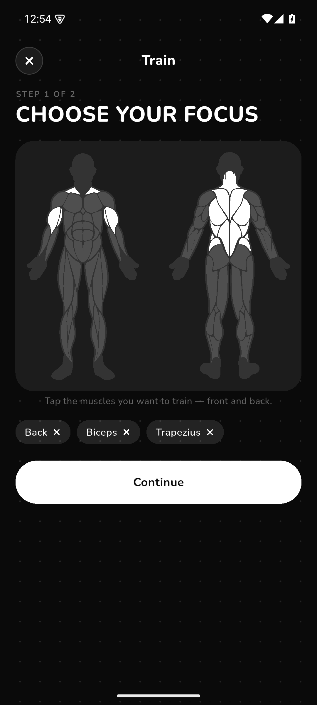
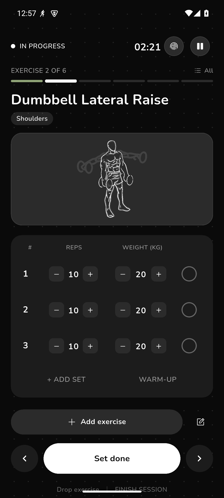
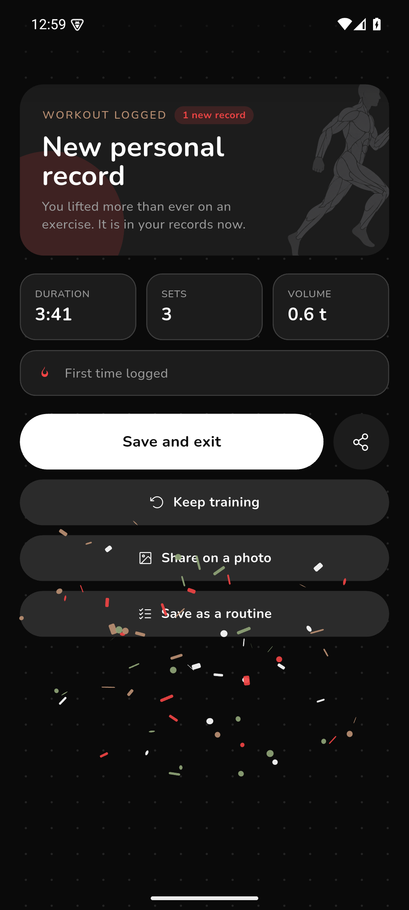
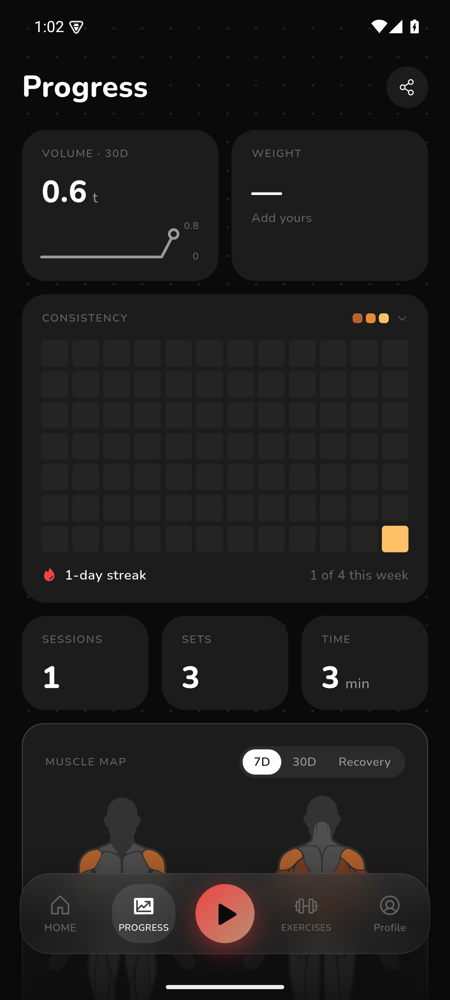
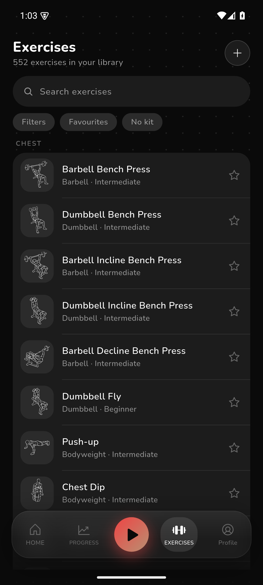
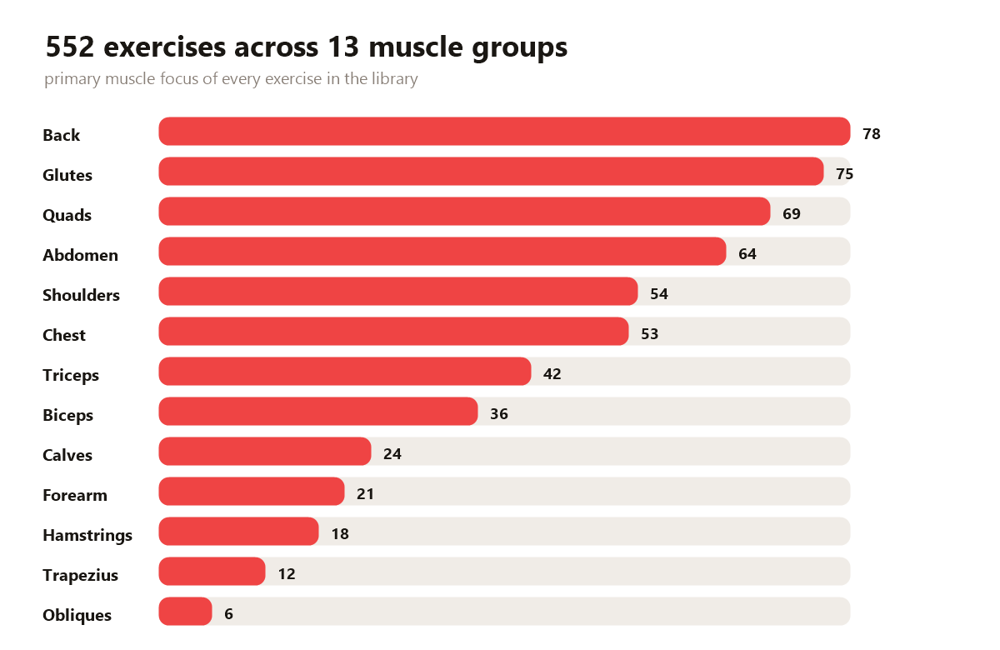

# MuscleMap

An offline gym log for Android. Tap the muscles you want to train, log your sets, and watch your numbers climb. No account, no ads, no internet permission. Everything stays on your phone.

<div align="center">
  
  
  
  
  <p><sub>Home, muscle map, live session, and the post workout summary.</sub></p>
</div>

## Why another gym app

Most logging apps want a subscription, an account, or both. MuscleMap keeps it simple: a free, offline log with no strings attached.

The core idea is the muscle map. Instead of scrolling through a flat list, you tap the muscles you want to train on a front and back body diagram and the app builds a session around them.

## What you get

- **Body map selection.** Front and back diagrams, 13 tracked muscle groups, and suggestions built from what you picked.
- **Real set logging.** Warm up sets, working sets, drop sets, RPE and RIR, supersets, and plate math when you are too lazy to count.
- **Rest timer that behaves.** Auto starts after a set, counts down on a notification you can see from the lock screen, and survives phone reboots.
- **552 exercises.** Every one has an animation, step by step instructions, and equipment filters.
- **Progress that means something.** Volume, streaks, personal records, a consistency heatmap, estimated 1RM curves, and a muscle map that shows what you actually trained.
- **Body tracking.** Weight plus 10 body measurements and progress photos.
- **Levels and medals.** A profile that levels up as you train, with 20 medals to unlock.
- **6 calculators.** 1RM, BMI, calories, body fat, plate math, and warm up percentages.
- **Home screen widgets.** Five of them, from a quick start button to a full week view.
- **CSV and ZIP export.** Full backups with media, plus import from Hevy, Strong, Lyfta, FitNotes, and more.

## Screenshots in action

| Progress | Exercises |
| --- | --- |
|  |  |

Consistency heatmap, muscle map with recovery view, and the exercise library.

## Install

Download the APK from the [Releases](https://github.com/HeetSoni26/MuscleMap/releases) page and install it on any Android 7.0+ device.

1. Download `MuscleMap-v1.0.0.apk`
2. Tap it on your phone
3. Allow installs from that app if Android asks (it is a side load, not a store install)
4. That is it. There is nothing to sign up for.

## Build it yourself

```bash
git clone https://github.com/HeetSoni26/MuscleMap.git
cd MuscleMap
flutter pub get
flutter build apk --release
```

The APK lands in `build/app/outputs/flutter-apk/`. Flutter 3.47 or newer is required.

## The exercise library

Every exercise in the catalog has a primary muscle focus, and the library is built around real training splits rather than one giant alphabetical list.



## Import, export, and your data

- Export workouts as CSV any time
- Full ZIP backups include media, notes, and timeline photos
- Restore on a new phone with one tap
- Coming from another app? MuscleMap reads Hevy, Strong, Lyfta, FitNotes, Fitbod, openGym, and generic CSV files

There is a "Delete all my data" button in settings if you ever want a clean slate. No cloud, no sync, no trace.

## Bugs and feature requests

Found something broken? [Open a bug report](https://github.com/HeetSoni26/MuscleMap/issues/new?template=bug_report.yml).

Want something added? [Request a feature](https://github.com/HeetSoni26/MuscleMap/issues/new?template=feature_request.yml).

## License

MuscleMap is licensed under [GPL-3.0](LICENSE). Exercise artwork is CC BY-SA 4.0 from Workout Guide and Everkinetic, and the Nunito font is used under the SIL OFL. Full credits are in [CREDITS.md](CREDITS.md).
